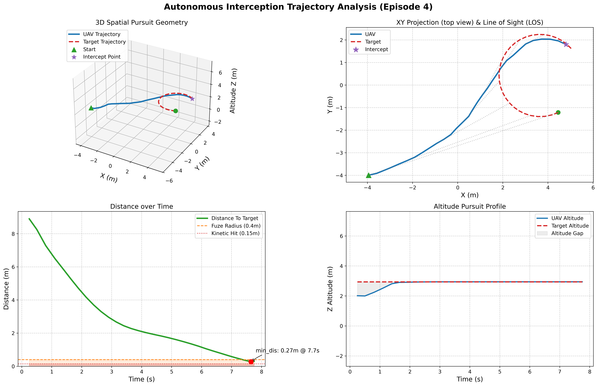
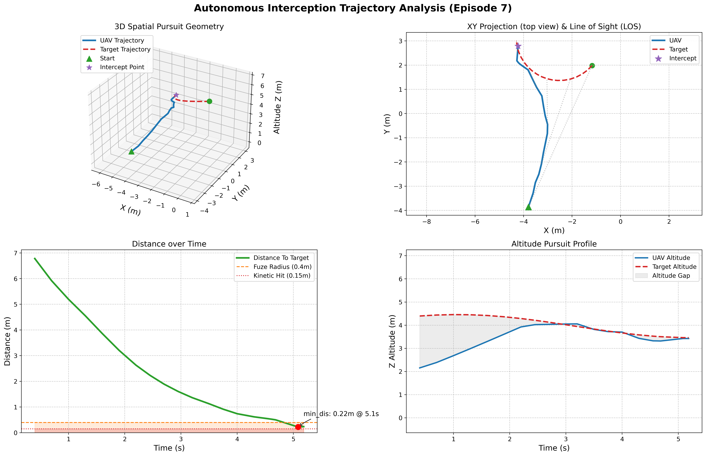
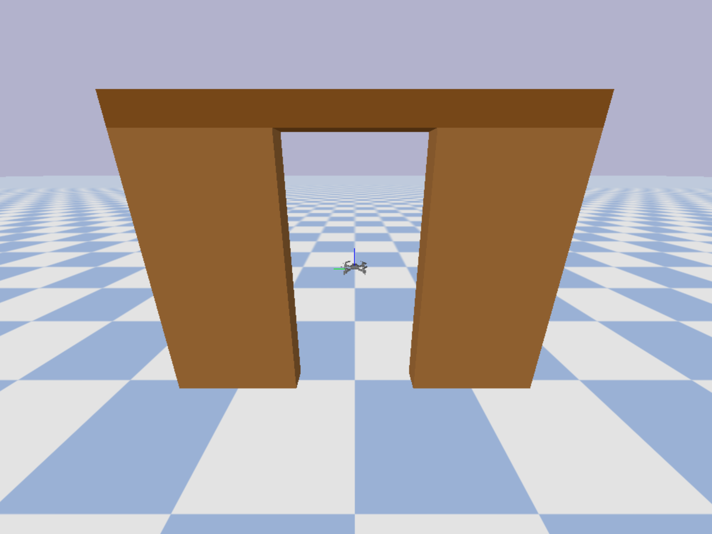

> [!TIP]
> Acknowledgment：The core simulation environment of this repository is built upon the excellent work of https://github.com/learnsyslab/gym-pybullet-drones. We deeply appreciate their contribution to the open-source community. My modifications mainly focus on the reinforcement learning algorithms and target tracking logic located in the examples/ folder. 

# gym-pybullet-drones

This repository is for displaying reinforcement learning examples of pybullet drones.


## Installation

```sh
git clone https://github.com/NishimiyaXSean/pybullet-rl-examples.git
cd gym-pybullet-drones/
conda create -n drone_rl python=3.10
conda activate drone_rl
pip install -e .
```

## Use

Download the model zip and pkl file released in the release and place them in the examples directory. With trained models, you can easily run tests in several missions.

```sh
cd gym-pybullet-drones/examples
python mission_v1.py
python mission_v2.py
python mission_v3.py
```



## Train and Test Models

### Basics

If you want to know the basic function and usage of gym-pybullet, check the examples/basic folder, which contains minimun workbase and several easy demos by the author.

```sh
cd gym-pybullet-drones/examples/basic
python learn.py 
python play.py # make sure the best_model.zip path is correct
```

### Tutorial

Addtionally, I also tried out some functions and saved them in the examples/start folder, which you can use as a tutorial demo. The main structrue of training file is shown in rl_flame.py.

```sh
cd gym-pybullet-drones/examples/start
python tactical_test_v1.0.py
# python tactical_test_v1.1.py 
# python tactical_test_v3.2.py
```




